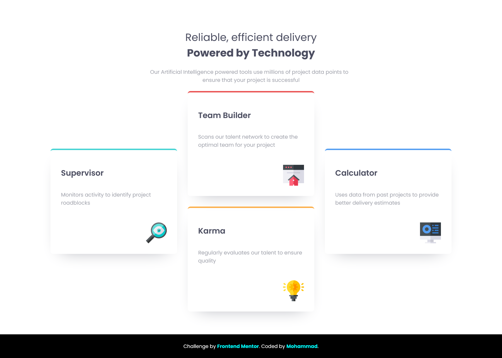
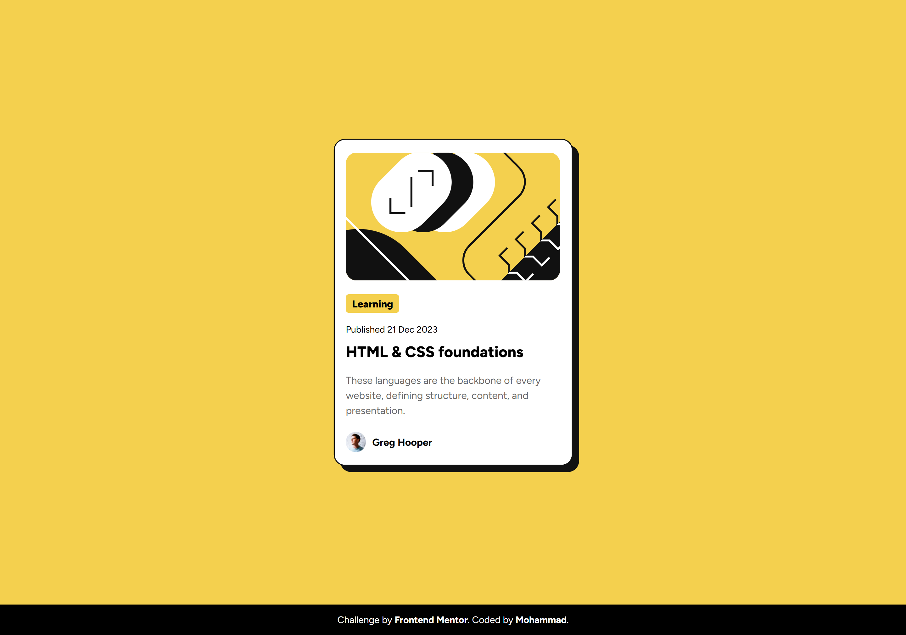

> note: i push my [frontend mentor](https://www.frontendmentor.io/profile/MohammadShool) exercises to this repository
> 
> you can follow me in [frontend mentor profile](https://www.frontendmentor.io/profile/MohammadShool)

# Components

- [testimonials grid section](#testimonials-grid-section)
- [four card feature section](#four-card-feature-section)
- [product preview card component](#product-preview-card-component)
- [recipe page](#recipe-page)
- [social links profile](#social-links-profile)
- [blog preview card](#blog-preview-card)
- [qr code component](#qr-code-component)
- [article preview component master](#article-preview-component-master)

## testimonials grid section

links:

- [github tree](https://github.com/MohammadShool/frontend-mentor-exercise/tree/master/testimonials-grid-section-main)
- [live preview](https://mohammadshool.github.io/frontend-mentor-exercise/testimonials-grid-section-main/)
- [frontend mentor page](https://www.frontendmentor.io/solutions/testimonials-grid-section-pV9i7jjUyA)
- [frontendmentor challenge page](https://www.frontendmentor.io/challenges/testimonials-grid-section-Nnw6J7Un7)

## four card feature section

links:

- [github tree](https://github.com/MohammadShool/frontend-mentor-exercise/tree/master/four-card-feature-section-master)
- [live preview](https://mohammadshool.github.io/frontend-mentor-exercise/four-card-feature-section-master/)
- [frontend mentor page](https://www.frontendmentor.io/solutions/four-card-feature-section-3TuHn3oZJL)
- [frontendmentor challenge page](https://www.frontendmentor.io/challenges/four-card-feature-section-weK1eFYK)

## product preview card component

links:

- [github tree](https://github.com/MohammadShool/frontend-mentor-exercise/tree/master/product-preview-card-component-main)
- [live preview](https://mohammadshool.github.io/frontend-mentor-exercise/product-preview-card-component-main/)
- [frontend mentor page](https://www.frontendmentor.io/solutions/product-preview-card-component-41bydqdiYr)
- [frontendmentor challenge page](https://www.frontendmentor.io/challenges/product-preview-card-component-GO7UmttRfa)

## recipe page

links:

- [github tree](https://github.com/MohammadShool/frontend-mentor-exercise/tree/master/recipe-page-main)
- [live preview](https://mohammadshool.github.io/frontend-mentor-exercise/recipe-page-main/)
- [frontend mentor page](https://www.frontendmentor.io/solutions/recipe-page-7AVWEmX8KT)
- [frontendmentor challenge page](https://www.frontendmentor.io/challenges/recipe-page-KiTsR8QQKm)

## social links profile

links:

- [github tree](https://github.com/MohammadShool/frontend-mentor-exercise/tree/master/social-links-profile-main)
- [live preview](https://mohammadshool.github.io/frontend-mentor-exercise/social-links-profile-main/)
- [frontend mentor page](https://www.frontendmentor.io/solutions/social-links-profile-z-InZ1_DT5)
- [frontendmentor challenge page](https://www.frontendmentor.io/challenges/social-links-profile-UG32l9m6dQ)

## blog preview card

links:

- [github tree](https://github.com/MohammadShool/frontend-mentor-exercise/tree/master/blog-preview-card-main)
- [live preview](https://mohammadshool.github.io/frontend-mentor-exercise/blog-preview-card-main/)
- [frontend mentor page](https://www.frontendmentor.io/solutions/blog-preview-card-fW1wkZZrsN)
- [frontendmentor challenge page](https://www.frontendmentor.io/challenges/blog-preview-card-ckPaj01IcS)

## qr code component

links:

- [github tree](https://github.com/MohammadShool/frontend-mentor-exercise/tree/master/qr-code-component-main)
- [live preview](https://mohammadshool.github.io/frontend-mentor-exercise/qr-code-component-main/)
- [frontend mentor page](https://www.frontendmentor.io/solutions/qr-code-component-sjESmwmszl)
- [frontendmentor challenge page](https://www.frontendmentor.io/challenges/qr-code-component-iux_sIO_H)

## article preview component master

links:

- [github tree](https://github.com/MohammadShool/frontend-mentor-exercise/tree/master/article-preview-component-master)
- [live preview](https://mohammadshool.github.io/frontend-mentor-exercise/article-preview-component-master/)
- [frontend mentor page](https://www.frontendmentor.io/solutions/article-preview-component-master-ij837wDt9V)
- [frontendmentor challenge page](https://www.frontendmentor.io/challenges/article-preview-component-dYBN_pYFT)